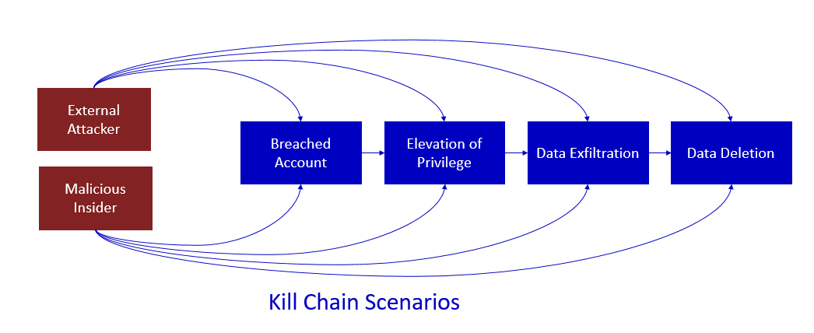
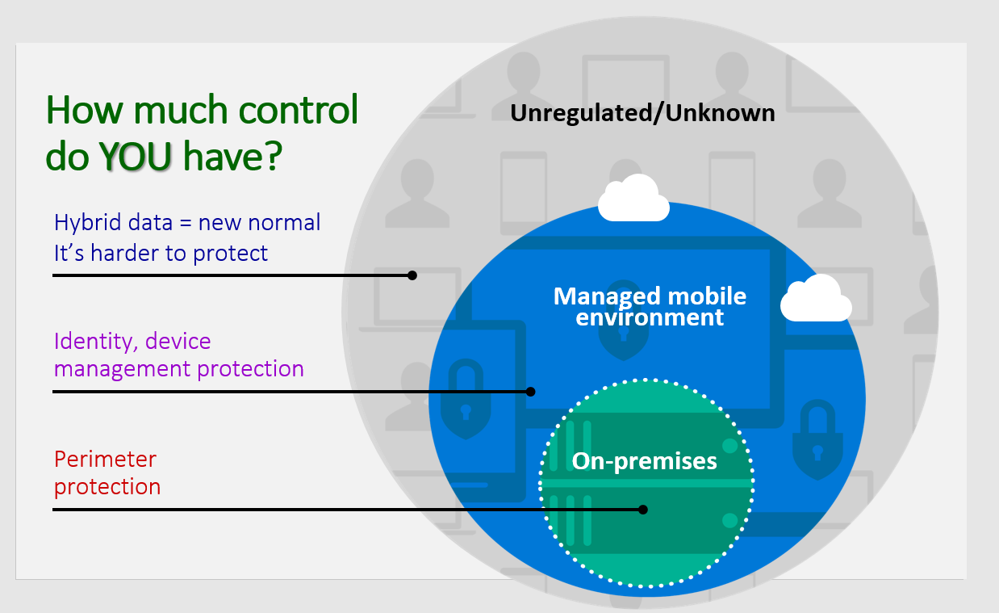

# threat Vector
In cybersecurity, a threat vector is the path or means by which a hacker can gain access to a *target* to deliver a malicious outcome.

## Target
* Computers and servers
* Usernames and passwords (known as account credentials)
* Personal information
* Financial information
* An organization’s plans for a new marketing campaign

# Explore today's work and threat landscape.
## Threats
In the security industry today,most attacks follow a common process refer to as *Kill Chain*.

Kill Chain refers to a attacks that follow a basic pattern and proceeds from one step to the next in order to achieve a wanted outcome. To defend against these type of attacks, Organizations can implement security measures on choke points in the chain, since attackers can bypass any step through various exploitation techniques.The best strategies apply defenses at every step along the chain. 

As the global threat landscape evolves, organizations are grappling with safeguarding their data while leveraging cloud computing benefits. They must protect user identities and data across various platforms, balancing flexibility with security. Despite implementing internal controls, data breaches persist due to sophisticated attacks and unauthorized use of third-party apps. Traditional on-premises security measures are insufficient as data now resides on various devices and in the cloud. Organizations face challenges in controlling data movement outside their environment and dealing with unregulated and unknown threats in a cloud-centric world.

## What is the way forward

Companies must navigate the challenge of operating securely in a world where they handle sensitive data, including intellectual property and personal identifiable information. Microsoft is committed to helping organizations enhance their security by providing protection against, detection of, and response to various threat vectors. The subsequent sections of this module will explore the most common threat vectors that organizations encounter today.

# Examine how phishing retrieves sensitive information